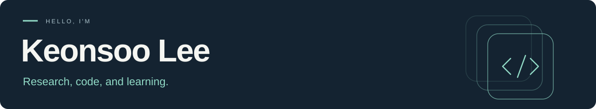

  <b>Software Engineering @ Korea Aerospace University</b> 
  <a href="mailto:ksl1165@kau.kr">Email</a> · <a href="https://github.com/LeeKeonSoo?tab=repositories">Projects</a>

### Hi, I'm Keonsoo 👋

I'm an undergraduate researcher at **QAI Lab, Korea Aerospace University**, and a former research intern at **DiSC Lab, UNLV**. I'm interested in how we can make language models smaller and more efficient, and how models can understand the world and act within it.

- 🔬 **Research** — Small language models, efficient training and inference, and world models.
- 🎓 **Education** — B.S. in Software Engineering, expected August 2027.
- 🌱 **Community** — President of **Deeperent**, an AI study group.
- 📚 **Teaching** — Teaching assistant for Data Structures and AI Programming in 2025.

### Things I've worked on

| Project | What you'll find |
| :--- | :--- |
| 🎮 **[Deeperent · FlappyFace](https://github.com/LeeKeonSoo/Deeperent)** | An interactive AI club demo: a real-time vision game controlled by facial movement. |
| 🔎 **[Korean AI Text Detection](https://github.com/LeeKeonSoo/2025_AI_Text)** | A team competition project exploring KoBERT fine-tuning and an ensemble of text embeddings and stylometric features. |
| ⚙️ **[Optimizer Experiments](https://github.com/LeeKeonSoo/2025_AI_Paper)** | Implementations and experiments comparing absolute-value-based adaptive optimizers with Adam and AdamW. |

### Research Experience

**QAI Lab · Korea Aerospace University** 
Undergraduate Researcher · June 2025–present

**DiSC Lab · University of Nevada, Las Vegas** 
Research Intern · January–May 2026; research continued through August 2026

---

Happy to connect about machine learning, research, and learning together. 
**[ksl1165@kau.kr](mailto:ksl1165@kau.kr)**
